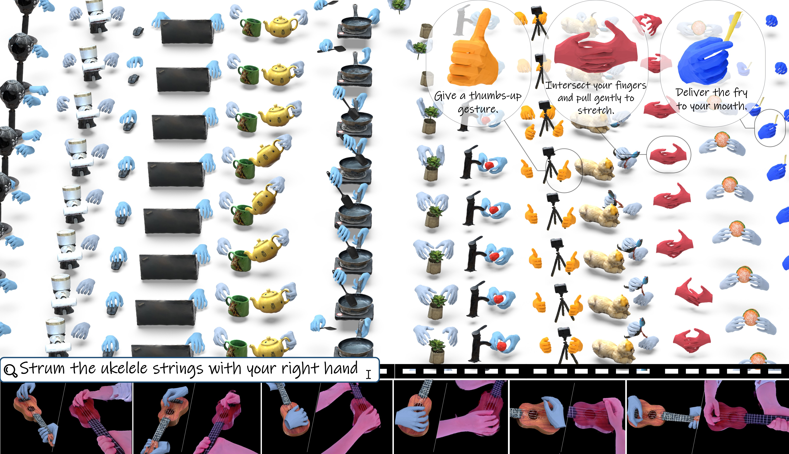

# :sparkles:[CVPR 2025 Highlight] GigaHands: A Massive Annotated Dataset of Bimanual Hand Activities

[CVPR 2025] Official repository of "GigaHands: A Massive Annotated Dataset of Bimanual Hand Activities".

[[Project Page]](https://ivl.cs.brown.edu/research/gigahands.html) [[Paper]](https://www.arxiv.org/abs/2412.04244) [[Video]](https://ivl.cs.brown.edu/assets/images/projects/gigahands/gigahands_explain.mp4)

<p> <strong>Authors</strong>:
    <a href="https://freddierao.github.io/">Rao Fu<sup>*</sup></a>
    ·
    <a href="https://kristen-z.github.io/">Dingxi Zhang<sup>*</sup></a>   
    ·
	<a href="https://www.alex-jiang.com/about/">Alex Jiang</a> 	 
    ·
	<a href="https://wanjia-fu.com/">Wanjia Fu</a>          
    ·
	<a href="https://austin-funk.github.io/">Austin Funk</a> 
    ·
	<a href="https://dritchie.github.io/">Daniel Ritchie</a> 
    ·
    <a href="https://cs.brown.edu/people/ssrinath/">Srinath Sridhar</a>
</p>


## Data Format

### Demo Data

The demo data contains 5 motion sequences. The file directory looks like this:

```
demo_data/
├── hand_pose/
    ├── p<participant id>-<scene>-<squence id>/
        ├── bboxes/							# bounding boxes for 2D keypoints tracking
        ├── keypoints_2d/						# 2D hand keypoints 
        ├── keypoints_3d/						# 3D hand keypoints (triangulate multi-view 2D keypoints.)
        ├── keypoints_3d_mano/						# 3D hand keypoints (extract from mano parms and normalized, more smooth)
        ├── mano_vid/							# visualizations of mano parameters 
        ├── params/							# mano parameters
        ├── rgb_vid/							# raw multview videos
        	├── brics-odrind-<camera id>-camx
        		├── xxx.mp4
        		├── xxx.txt
        	├── ...
        ├── repro_2d_vid/						# visualizations of 2d hand keypoints
        ├── repro_3d_vid/						# visualizations of 3d hand keypoints
        ├── optim_params.txt						# camera parameters
    ├── ...
└── object_pose
    ├── p<participant id>-<scene>-<squence id>/
        ├── mesh							# reconstructed object mesh
        ├── pose							# object pose
        ├── render							# visualizations of object pose
        ├── segmentation						# segmented object frames
    ├── ...
```

We store our dataset on Globus. You can download a demo sequence from [here](https://g-2488dc.56197.5898.data.globus.org/demo_data.tar%2Cgz), all annotations from [here](https://g-2488dc.56197.5898.data.globus.org/demo_all.tar.gz), and access the raw data via [here](https://app.globus.org/file-manager?origin_id=1f1426dd-3440-4cae-8c57-4a0e6934eaf2&origin_path=%2F).

### Whole Dataset

We just released all the hand pose data [here](https://g-2488dc.56197.5898.data.globus.org/hand_poses.tar.gz) (Including all `keypoints_3d`,  `keypoints_3d_mano` and `params`). 

More data will be available soon—stay tuned!


## Installation

This code requires:

* Python 3.8
* conda3 or miniconda3
* CUDA capable GPU (one is enough)

1. Create a virtual environment and install necessary dependencies

```shell
conda create -n gigahands python==3.8
conda activate gigahands
conda install pytorch==2.2.0 torchvision==0.17.0 torchaudio==2.2.0 pytorch-cuda=12.1 -c pytorch -c nvidia
conda install -c conda-forge ffmpeg
pip install -r requirements.txt
```

3. Install EasyMocap

```shell
cd third-party/EasyMocap
python setup.py develop
```
4. Download [mano](https://mano.is.tue.mpg.de/download.php) models and place the `MANO_*.pkl` files under `body_models/smplh`.

## Visualizations

After downloading all hand pose annotations, run the script below to visualize them. By default, the dataset is placed under the `dataset/hand_pose` directory.

```shell
python visualize_hands.py --dataset_root dataset/hand_pose --save_dir ./visualizations
```

You will see videos of the MANO render results and reprojected keypoints in the `visualizations` directory.

## Checklist

- [x] Release demo data
- [ ] Release inference code for text-to-motion task
- [ ] Release training code for text-to-motion task
- [ ] Release whole dataset

## Citation

If you find our work useful in your research, please consider citing:

```
@article{fu2024gigahands,
  title={GigaHands: A Massive Annotated Dataset of Bimanual Hand Activities},
  author={Fu, Rao and Zhang, Dingxi and Jiang, Alex and Fu, Wanjia and Funk, Austin and Ritchie, Daniel and Sridhar, Srinath},
  journal={arXiv preprint arXiv:2412.04244},
  year={2024}
}
```

